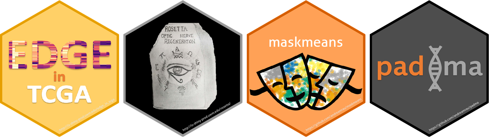

### Related software

1. **rpl**: Randomized pairwise likelihood method for complex statistical inferences [:link:](https://github.com/andreamrau/rpl)
1. **padma**: Pathway deviation scores using multiple factor analysis [:link:](https://bioconductor.org/packages/padma/)
1. **Regeneration Rosetta**: An R/Shiny interactive web application to explore regeneration-associated gene expression and chromatin accessibility [:link:](https://rosetta.sk8.inrae.fr/)
1. **maskmeans**: Multi-view aggregation/splitting K-means clustering algorithm [:link:](https://github.com/andreamrau/maskmeans)
1. **Edge in TCGA**: An R/Shiny interactive web application for the exploration of drivers of gene expression in The Cancer Genome Atlas [:link:](http://ls-shiny-prod.uwm.edu/edge_in_tcga/)

### Related publications

1. Mazo, G., Karlis, D., and **Rau, A.** (2023) A randomized pairwise likelihood method for complex statistical inferences. *Journal of the American Statistical Association*, 547:2317-2327. [:link:](https://dx.doi.org/10.1080/01621459.2023.2257367)[:arrows_counterclockwise:](https://hal.archives-ouvertes.fr/hal-03126621)[:computer:](https://github.com/andreamrau/rpl)

1. Mollandin, F., Gilbert, H., Croiseau, P., and **Rau, A.** (2022) Accounting for overlapping annotations in genomic prediction models of complex traits. *BMC Bioinformatics*, 23:65. [:link:](https://dx.doi.org/10.1186/s12859-022-04914-5)[:page_facing_up:](https://bmcbioinformatics.biomedcentral.com/articles/10.1186/s12859-022-04914-5)[:arrows_counterclockwise:](https://www.researchsquare.com/article/rs-1366477/v1)[:computer:](https://github.com/fmollandin/BayesRCO)

1. Mollandin, F., Gilbert, H., Croiseau, P., and **Rau, A.** (2022) Capitalizing on complex annotations in Bayesian genomic prediction for a backcross population of growing pigs. *12th World Congress on Genetics Applied to Livestock Production (3-8 July 2022)*, Rotterdam, Netherlands. [:link:](https://dx.doi.org/10.3920/978-90-8686-940-4_303)[:page_facing_up:](https://www.wageningenacademic.com/doi/epdf/10.3920/978-90-8686-940-4_303?role=tab)

1. **Rau, A.**, Manansala, R., Flister, M. J., Rui, H., Jaffrézic, F., Laloë, D., and Auer, P. L. (2022) Individualized multi-omic pathway deviation scores using multiple factor analysis. *Biostatistics*, 23(2):362-379. [:link:](https://dx.doi.org/10.1093/biostatistics/kxaa029)[:page_facing_up:](https://academic.oup.com/biostatistics/article/23/2/362/5882080?guestAccessKey=fad8d201-b50c-47e5-b4b9-326e5fe62567)[:arrows_counterclockwise:](https://www.biorxiv.org/content/10.1101/827022v2)[:input_numbers:](https://github.com/andreamrau/RMFRJLA_2019)[:computer:](https://bioconductor.org/packages/padma/)

1. Godichon-Baggioni, A., Maugis-Rabusseau, C. and **Rau, A.** (2020) Multi-view cluster aggregation and splitting, with an application to multi-omic breast cancer data. *Annals of Applied Statistics*, 14:2, 752-767. [:link:](https://dx.doi.org/10.1214/19-AOAS1317)[:page_facing_up:](https://projecteuclid.org/euclid.aoas/1593449324)[:input_numbers:](https://github.com/andreamrau/maskmeans)

1. Foissac, S., Djebali, S., Munyard, K., Villa-Vialaneix, N., **Rau, A.**, Muret, K., Esquerre, D., Zytnicki, M., Derrien, T., Bardou, P., Blanc, F., Cabau, C., Crisci, E., Dhorne-Pollet, S., Drouet, F., Gonzales, I., Goubil, A., Lacroix-Lamande, S., Laurent, F., Marthey, S., Marti-Marimon, M., Momal-Leisenring, R., Mompart, F., Quere, P., Robelin, D., San Cristobal, M., Tosser-Klopp, G., Vincent-Naulleau, S., Fabre, S., Pinard-Van der Laan, M.-H., Klopp, C., Tixier-Boichard, M., Acloque, H., Lagarrigue, S., Giuffra, E. (2019) Multi-species annotation of transcriptome and chromatin structure in domesticated animals. *BMC Biology*, 18:48. [:link:](https://dx.doi.org/10.1186/s12915-019-0726-5)[:page_facing_up:](https://bmcbiol.biomedcentral.com/articles/10.1186/s12915-019-0726-5)[:arrows_counterclockwise:](https://www.biorxiv.org/content/early/2018/05/11/316091v2)

1. Dhara, S., **Rau, A.**, Flister, M., Recka, N., Laiosa, M., Auer, P., and Udvadia, A. (2019) Cellular reprogramming for successful CNS axon regeneration is driven by a temporally changing cast of transcription factors. *Scientific Reports*, 9:14198. [:link:](https://dx.doi.org/10.1038/s41598-019-50485-6)[:page_facing_up:](https://www.nature.com/articles/s41598-019-50485-6)[:arrows_counterclockwise:](https://www.biorxiv.org/content/10.1101/638734v3)[:input_numbers:](https://github.com/andreamrau/OpticRegen_2019)

1. **Rau, A.**, Dhara, S., Udvadia, A., and Auer, P. (2019) Regeneration Rosetta: An interactive web application to explore regeneration-associated gene expression and chromatin accessibility. *G3: Genes|Genomes|Genetics*, 9(12): 3953-3959. [:link:](https://dx.doi.org/10.1534/g3.119.400729)[:page_facing_up:](https://www.g3journal.org/content/9/12/3953)[:input_numbers:](https://github.com/andreamrau/rosetta)

1. **Rau, A.**, Flister, M. J., Rui, H. and Livermore Auer, P. (2019) Exploring drivers of gene expression in The Cancer Genome Atlas. *Bioinformatics*, 35(1): 62-68. [:link:](https://dx.doi.org/10.1093/bioinformatics/bty551)[:page_facing_up:](https://academic.oup.com/bioinformatics/advance-article-abstract/doi/10.1093/bioinformatics/bty551/5047764)[:arrows_counterclockwise:](https://www.biorxiv.org/content/early/2018/05/02/227926)[:input_numbers:](https://github.com/andreamrau/EDGE-in-TCGA)

