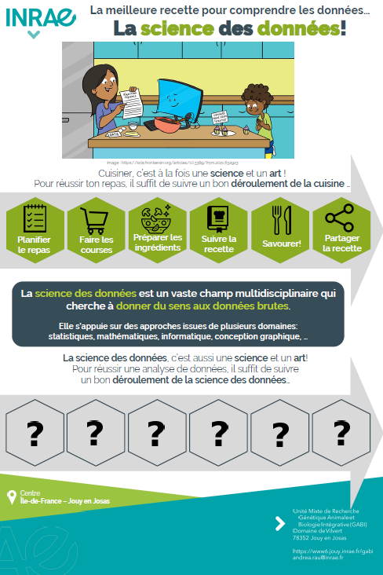

<blockquote class="twitter-tweet">
👩‍🍳How to cook knowledge with <a href="https://twitter.com/hashtag/BigData?src=hash&amp;ref_src=twsrc%5Etfw">#BigData</a>? <a href="https://twitter.com/andreamrau?ref_src=twsrc%5Etfw">@andreamrau</a>, researcher of <a href="https://twitter.com/GeneSwitch?ref_src=twsrc%5Etfw">@GeneSwitch</a> project, explains why Big Data🖥️ is becoming important in <a href="https://twitter.com/hashtag/AnimalBreeding?src=hash&amp;ref_src=twsrc%5Etfw">#AnimalBreeding</a>🧬  😋Check out our tasty recipe and learn more: <a href="https://t.co/2YJiXcPFuD">https://t.co/2YJiXcPFuD</a>  🇪🇺<a href="https://twitter.com/CORDIS_EU?ref_src=twsrc%5Etfw">@CORDIS_EU</a> <a href="https://twitter.com/hashtag/Genomics?src=hash&amp;ref_src=twsrc%5Etfw">#Genomics</a> <a href="https://twitter.com/hashtag/Livestock?src=hash&amp;ref_src=twsrc%5Etfw">#Livestock</a> <a href="https://t.co/IrLKr0aucj">pic.twitter.com/IrLKr0aucj</a>
&mdash; GENE-SWitCH (@GeneSwitch) <a href="https://twitter.com/GeneSwitch/status/1588161215506759680?ref_src=twsrc%5Etfw">November 3, 2022</a></blockquote>  

<blockquote class="twitter-tweet">
Nos chercheurs sont là pour vous tout le week end à <a href="https://twitter.com/ENS_ParisSaclay?ref_src=twsrc%5Etfw">@ENS_ParisSaclay</a> pour la fête de la science <a href="https://twitter.com/hashtag/FDS2022?src=hash&amp;ref_src=twsrc%5Etfw">#FDS2022</a>  Ils vous parleront notamment de l’adaptation des animaux à la chaleur, la science des données et l’ADN. <a href="https://twitter.com/UnivParisSaclay?ref_src=twsrc%5Etfw">@UnivParisSaclay</a>  <a href="https://twitter.com/AgroParisTech?ref_src=twsrc%5Etfw">@AgroParisTech</a>  <a href="https://twitter.com/INRAE_IDF?ref_src=twsrc%5Etfw">@INRAE_IDF</a>  <a href="https://twitter.com/INRAE_DPT_GA?ref_src=twsrc%5Etfw">@INRAE_DPT_GA</a> <a href="https://t.co/RrzE5sjWmp">pic.twitter.com/RrzE5sjWmp</a>
&mdash; Génétique Animale et Biologie Intégrative UMR GABI (@UMR_GABI) <a href="https://twitter.com/UMR_GABI/status/1578368043499294721?ref_src=twsrc%5Etfw">October 7, 2022</a></blockquote>  

<iframe width="475" height=267" src="https://www.youtube.com/embed/VWEBe2Wpi60" title="The EuroFAANG Glossary: Machine Learning, Algorithms and Bayesian Models." frameborder="0" allow="accelerometer; autoplay; clipboard-write; encrypted-media; gyroscope; picture-in-picture" allowfullscreen></iframe>

<blockquote class="twitter-tweet">
<a href="https://twitter.com/hashtag/FDS2021?src=hash&amp;ref_src=twsrc%5Etfw">#FDS2021</a> Intervention en classe d’Andrea Rau, chercheur <a href="https://twitter.com/hashtag/INRAE?src=hash&amp;ref_src=twsrc%5Etfw">#INRAE</a> cet après-midi dans une classe de <a href="https://twitter.com/hashtag/NeuvilleStAmand?src=hash&amp;ref_src=twsrc%5Etfw">#NeuvilleStAmand</a> sur les <a href="https://twitter.com/hashtag/sciences?src=hash&amp;ref_src=twsrc%5Etfw">#sciences</a> des <a href="https://twitter.com/hashtag/donn%C3%A9es?src=hash&amp;ref_src=twsrc%5Etfw">#données</a>📊. Des enfants curieux et posant de nombreuses questions☝🏻. Merci à l’enseignante et aux enfants pour leur accueil chaleureux. <a href="https://t.co/AWDcedQlXN">pic.twitter.com/AWDcedQlXN</a>
&mdash; INRAE Hauts-de-France (@INRAE_HdF) <a href="https://twitter.com/INRAE_HdF/status/1445418594163167234?ref_src=twsrc%5Etfw">October 5, 2021</a></blockquote>  

<blockquote class="twitter-tweet">
What do you know about coding? 🧐  Today we invite you to listen to Dr. <a href="https://twitter.com/andreamrau?ref_src=twsrc%5Etfw">@andreamrau</a> explain what data scientists seek to discover when <a href="https://twitter.com/hashtag/coding?src=hash&amp;ref_src=twsrc%5Etfw">#coding</a> and working with <a href="https://twitter.com/hashtag/data?src=hash&amp;ref_src=twsrc%5Etfw">#data</a>! <a href="https://twitter.com/BovReg?ref_src=twsrc%5Etfw">@BovReg</a> <a href="https://twitter.com/GeneSwitch?ref_src=twsrc%5Etfw">@GeneSwitch</a> <a href="https://twitter.com/GeronimoH2020?ref_src=twsrc%5Etfw">@GeronimoH2020</a> <a href="https://twitter.com/AQUA_FAANG?ref_src=twsrc%5Etfw">@AQUA_FAANG</a> <a href="https://twitter.com/RUMIGENH2020?ref_src=twsrc%5Etfw">@RUMIGENH2020</a> <a href="https://twitter.com/CORDIS_EU?ref_src=twsrc%5Etfw">@CORDIS_EU</a>   🔗Learn more: <a href="https://t.co/QYV5RvnIXk">https://t.co/QYV5RvnIXk</a> <a href="https://t.co/ayUlbGwgKx">pic.twitter.com/ayUlbGwgKx</a>
&mdash; GENE-SWitCH (@GeneSwitch) <a href="https://twitter.com/GeneSwitch/status/1501490287931179012?ref_src=twsrc%5Etfw">March 9, 2022</a></blockquote>  

